# Язык Java

## Осенний семестр 2023, магистратура, 1 курс

### Лекция 1: Введение

---

## Темы курса

- Базовые темы
  - Введение
  - Базовые конструкции языка (переменные, циклы, массивы, строки, ...)
  - Объектно-ориентированное программирование (классы и объекты)
  - Коллекции (List, Map, ...) и Stream API
  - Работа с файлами и обработка ошибок
- Продвинутые темы (2 лекции)
  - ...
  - ...

---

## Продвинутые темы на выбор

- Обзор фреймворка Spring Boot
- Многопоточность в Java
- Сетевое взаимодействие в Java
- Работа с базами данных в Java
- Объектно-ориентированная архитектура и Clean Code
- Архитектура виртуальной машины Java
- Reflection API

[Ссылка](https://forms.gle/6YajZ939qpfmuz7G9) для голосования

---

## Отчетность по курсу

- Зачет с оценкой
- Два способа получения зачета:
  - Реализация и защита учебного проекта
  - Лайвкодинг-сессия + вопросы по теории

---

## Литература

1. Кей С. Хорстманн "Java. Библиотека профессионала". Tом 1. Основы.
2. Кэти Сьерра и Берт Бейтс "Изучаем Java" (Head First Java).
3. Эрик Фримен, Элизабет Фримен "Паттерны проектирования" (Head First Design Patterns).
4. Марк Хеклер. "Spring Boot по-быстрому".
5. Роберт Мартин. "Чистый Код".

---

## Содержание лекции

1. Комплект разработчика JDK.
2. Интегрированная среда разработки IntelliJ IDEA.
3. Проект "Hello, World"
4. Компиляция и запуск программы на Java.
5. Стандартные и пользовательские библиотеки Java.
6. Система сборки Maven.

---

## Экосистема Java

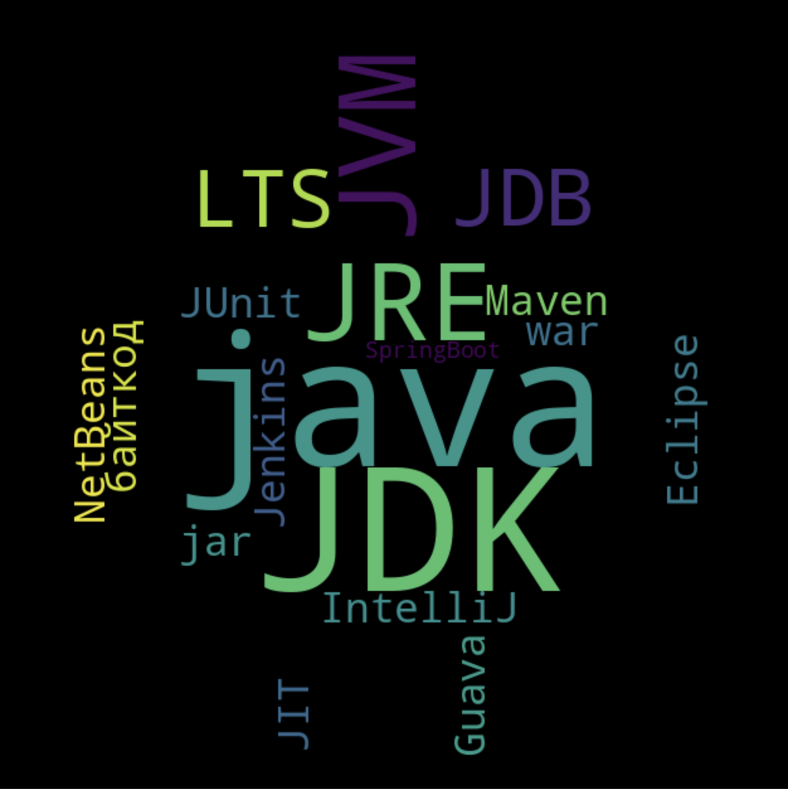

---

## Комплект разработчика JDK: основные компоненты

1. Компилятор javac
2. Среда разработки JRE (Java Runtime Environment):
   - Виртуальная машина JVM (Java Virtual Machine)
   - Стандартная библиотека классов (Java API)
   - Classloader: динамическая загрузка классов в JVM
3. Отладчик jdb

Т.o.: JVM $\in$ JRE $\in$ JDK

---

## Версия JDK

- LTS (Long-Term-Support) версия: 17
- Рекомендованная реализация JDK: [Adoptium Eclipse Temurin](https://adoptium.net/)

---

## Интегрированная среда разработки (IDE): основные функции

- Примеры IDE: IntelliJ IDEA, Eclipse, NetBeans
- Основные функции:
  - Редактор исходного кода
    - поиск кода
    - автогенерация кода
    - автодополнение кода (IntelliSense)
    - автоматизированный рефакторинг
  - Автоматизация сборки проекта
  - Отладка (debugging)
  - Поддержка контроля версий (Git, Subversion, ...)

---

## Рекомендованная IDE: IntelliJ IDEA

- [Ссылка для скачивания](https://www.jetbrains.com/idea/download/)
- Полная коммерческая версия (платная): Ultimate
- Бесплатная версия (с ограниченным функционалом): **Community Edition**
- **Важно:** IntelliJ IDEA не включает в себя JDK

---

## Загрузка IntelliJ IDEA

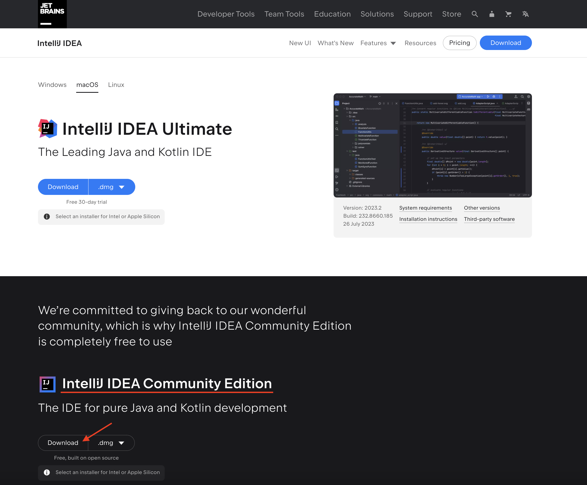

---

## Новый проект в IntelliJ IDEA

- Создать новый проект ->
- Загрузить JDK
  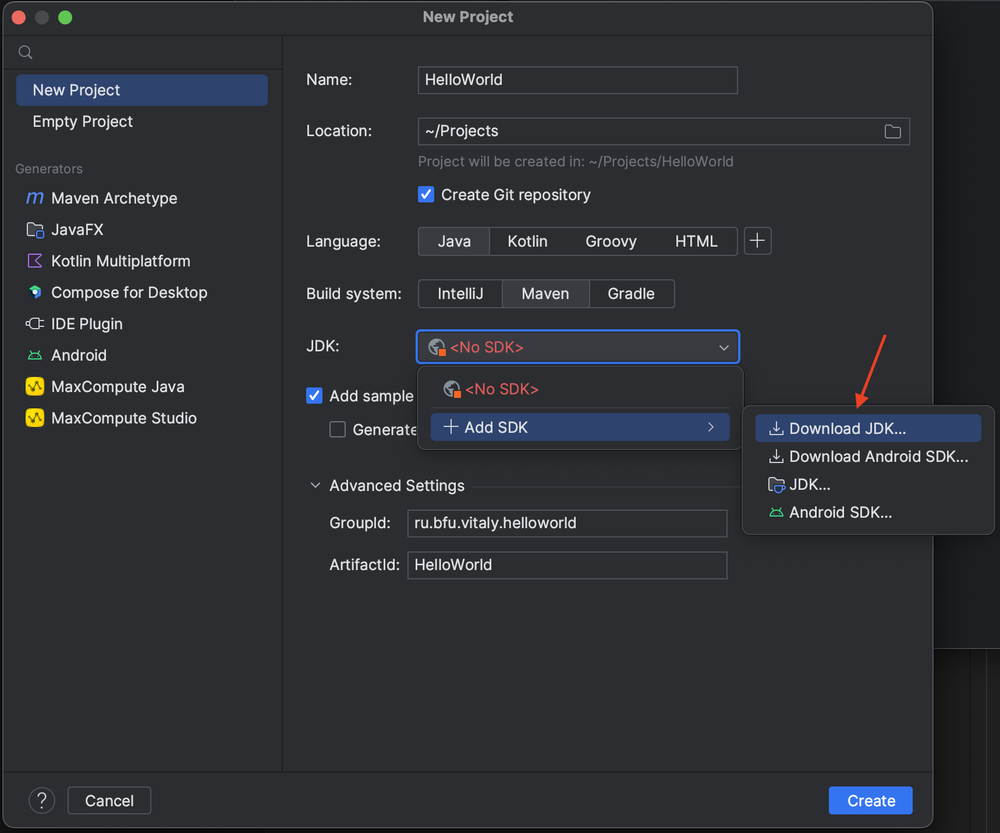
  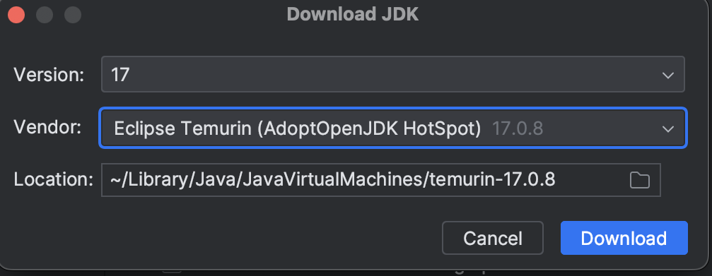

---

## Структура проекта "Hello world"

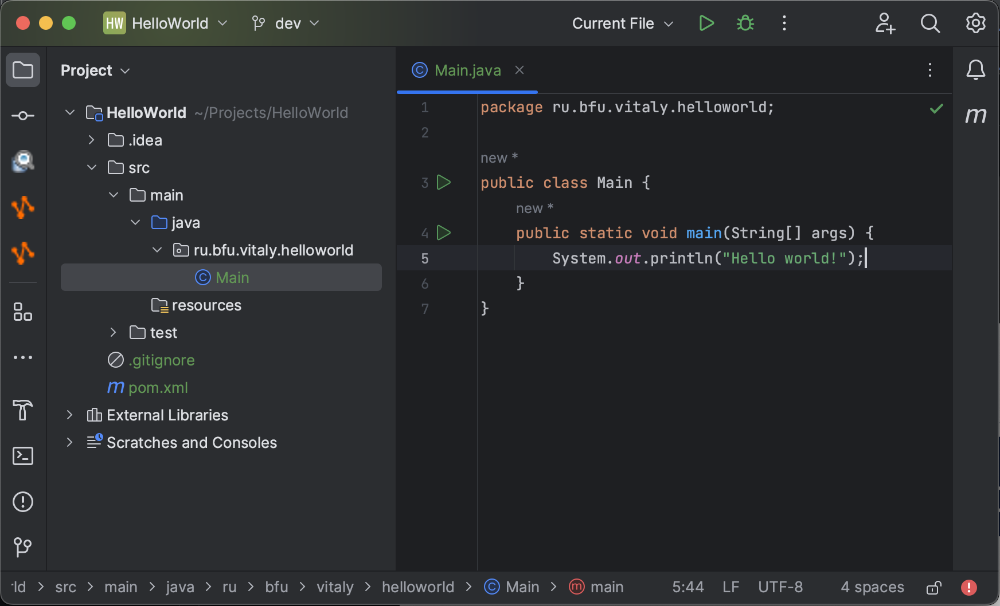

---

## Запуск программы "Hello world"

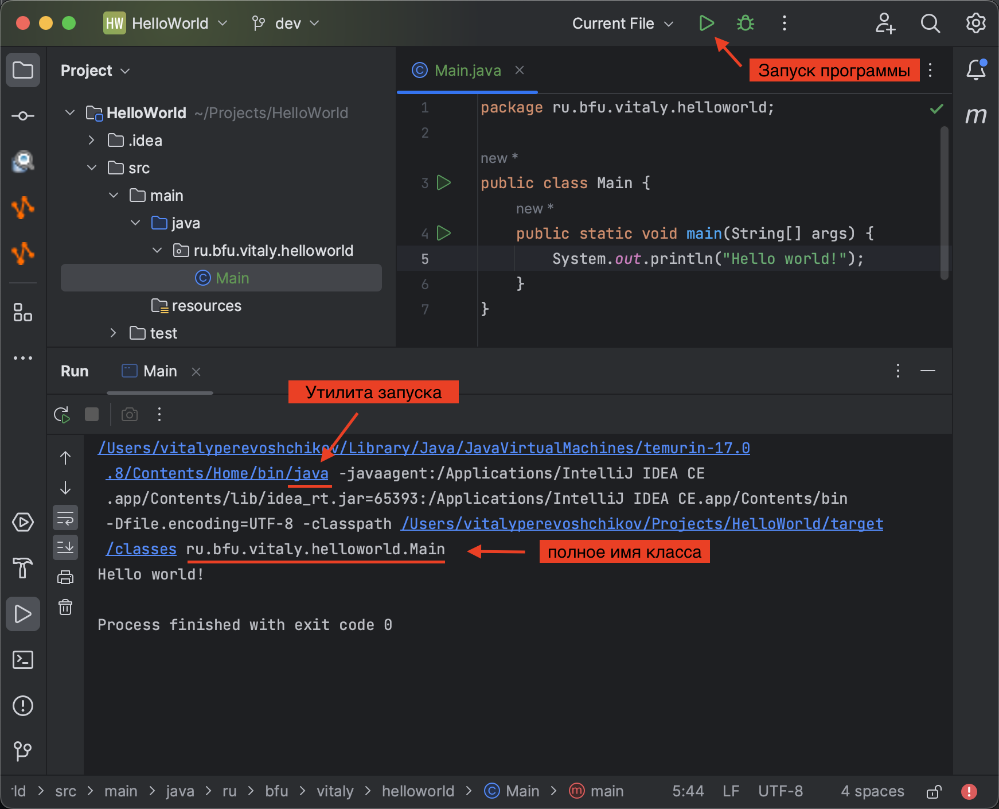

---

## А что конкретно запускается-то?

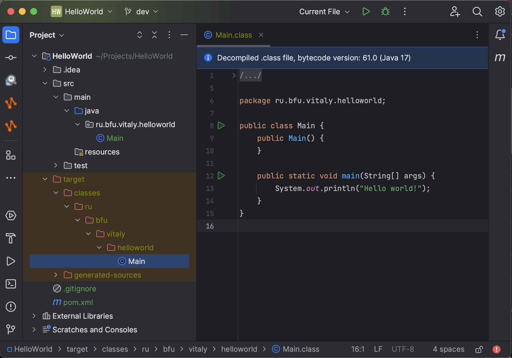

- Main.java компилируется в файл Main.class с **байт-кодом**
- Байт-код выполняется на JVM

---

## Байт-код

- Байт-код - набор инструкций для виртуальной машины JVM
- Байт-код не зависит от платформы (ОС, архитектуры процессора)
- Байт-код не является машинным кодом конкретной платформы

---

## Запуск байт-кода на JVM

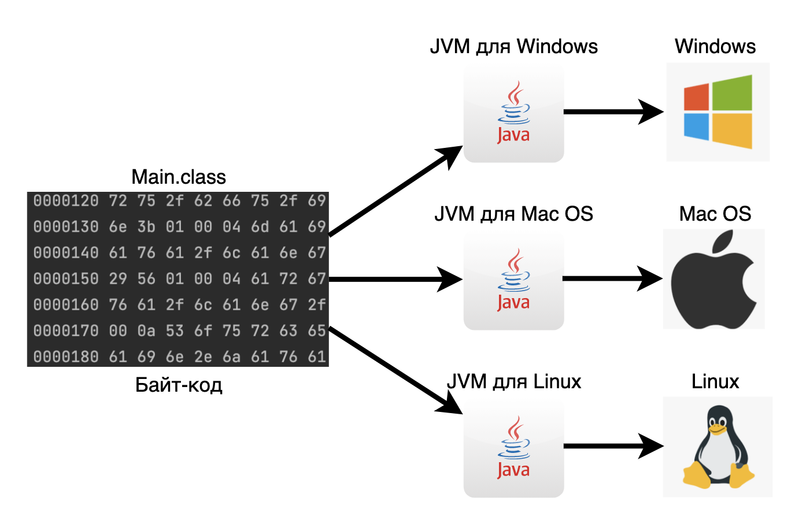

- JVM реализуется для каждой платформы отдельно
- JVM преобразует байт-кот в машинный код отдельной платформы
  - используется JIT-компиляция
- Другие языки, использующие JVM:
  - Kotlin
  - Scala
  - Groovy

---

## Стандартные библиотеки Java

- Примеры:
  - **java.lang**: строки, математические функции и т.д.
  - **java.util**: коллекции и структуры данных
  - **java.io**: чтение и запись в файлы
  - **java.net**: сетевое взаимодействие
  - **java.time**: работа с датами и временем

---

## Пример использования стандартной библиотеки

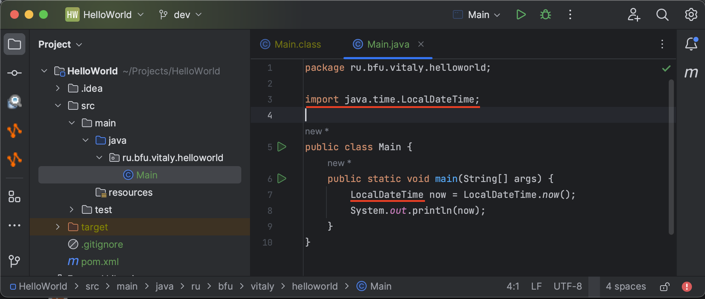

---

## Нестандартные (пользовательские) библиотеки

- Примеры:
  - **Apache Commons**: набор различных Java-утилит
  - **Guava**: набор основных библиотек Google для Java
  - **JUnit**: библиотека для создания юнит-тестов

---

## Пример добавления библиотеки Guava в проект: часть 1

1. Открыть File -> Project Structure
2. Выбрать Project Settings -> Libraries
3. Нажать на "+" ("New project library") и выбрать опцию "From Maven..."
  

---

## Пример добавления библиотеки Guava в проект: часть 2

4. Загрузить библиотеку Guava из Maven-репозитория:
   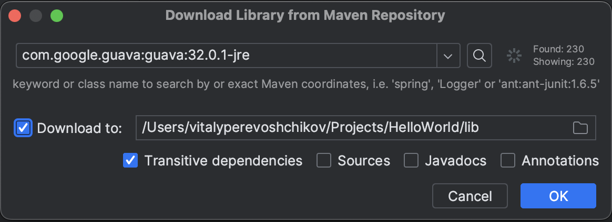
Maven-координаты: groupId:artifactId:version

---

## Пример добавления библиотеки Guava в проект: часть 3

5. Результат загрузки библиотеки:
  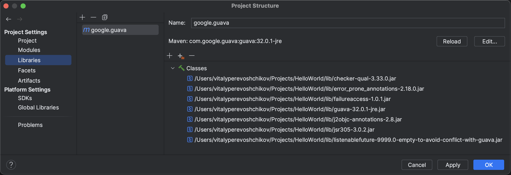
.jar - Java-архив, т.е., ZIP-архив с байт-кодом и метаданными

---

## Пример использования библиотеки Guava

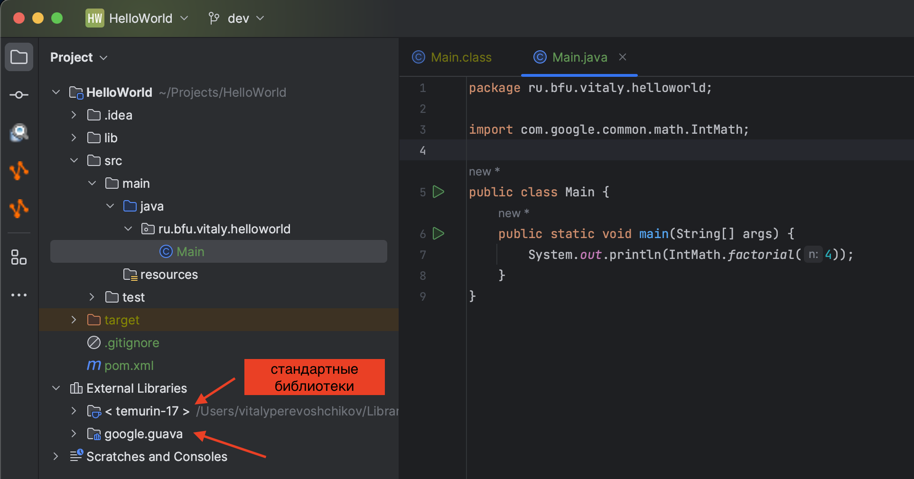

- Что будет выведено в консоль?
- Нужно ли всякий раз вручную загружать все внешние библиотеки?

---

## Автоматизация сборки проектов с помощью Apache Maven

1. [Веб-страница](https://maven.apache.org/) проекта Maven
2. Основные функции Maven
   - Загрузка зависимостей (библиотек) из удаленного репозитория
   - Компиляция исходного кода
   - Запуск тестов
   - Упаковка скомпилированных файлов (например, в jar-архивы)
   - Загрузка собранных архивов в удаленный репозиторий
3. Maven интегрирован с IntelliJ IDEA.

---

## Работа с Maven в IntelliJ

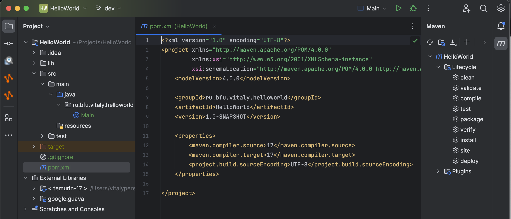

- pom.xml - главный файл для управления Maven

---

## Поиск библиотеки Guava в Maven-репозитории

1. [Ссылка](https://mvnrepository.com/) на Maven-репозиторий
2. Поиск библиотеки Guava ([ссылка](https://mvnrepository.com/artifact/com.google.guava/guava/32.1.2-jre))
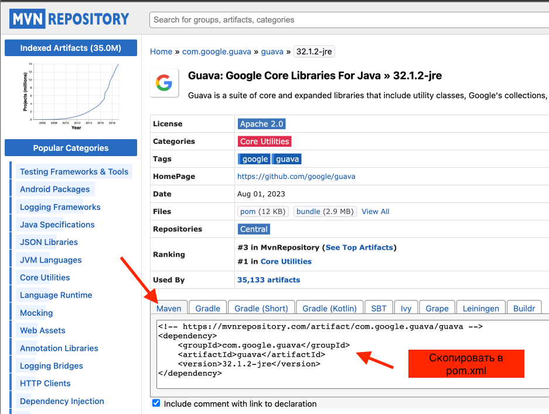

---

## Добавление зависимости в проект

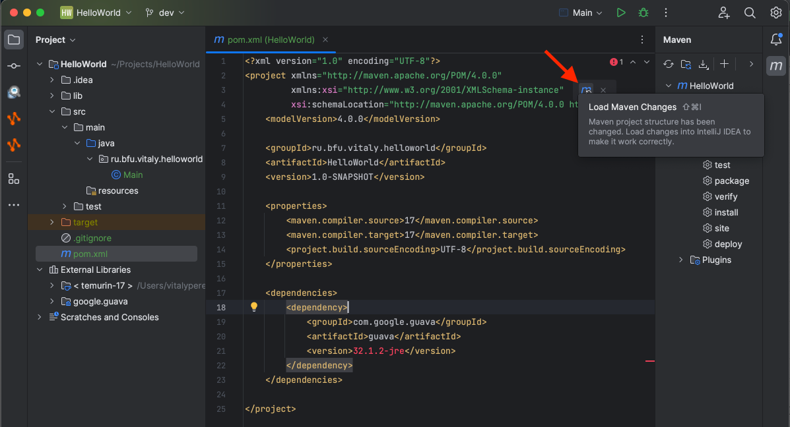

---

## Важные темы за рамками этого курса

- Непрерывная интеграция (CI) и непрерывное развертывание (CD) с помощью Jenkins (TeamCity, CircleCI, GitLab CI, ...)
- Контейнеризация приложений с помощью Docker и Kubernetes.

---

## Домашнее задание

1. Установить IntelliJ IDEA и JDK
2. Создать новый проект и загрузить в него последнюю версию Apache-библиотеки commons-math3 из Maven (c помощью добавления зависимости в pom.xml)
3. Найти в библиотеке commons-math3 метод для вычисления факториала.
4. Используя этот метод, вычислить факториал числа 5 и вывести результат в консоль.