# Язык Java

## Осенний семестр 2023, магистратура, 1 курс

### Лекция 7: Spring MVC

---

## Содержание

1. HTTP-запросы
2. Архитектура Spring MVC
3. Демо-проект

---

## HTTP-запросы

- Удобная программа для выполнения HTTP запросов: [Postman](https://www.postman.com/)
- Пример API: [Open Library Search API](https://openlibrary.org/dev/docs/api/search)
- Пример GET запроса: поиск книг по названию и имени автора:

    ```java
    GET http://openlibrary.org/search.json?title=Clean%20Code&author=Martins
    ```

  - Протокол: `http`
  - Хост: `openlibrary.org`
  - Путь к ресурсу: `/search.json`
  - Параметры поиска (query params):
    - `title=Clean%20Code`
    - `author=Martins`

---

## Структура HTTP сообщений

- Запрос (request)
  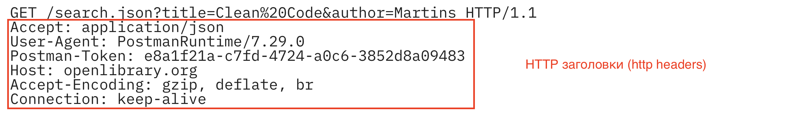

- Ответ (response)
  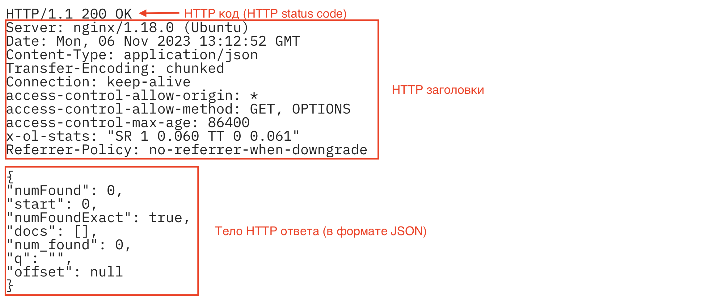

---

## Основные задачи веб-приложения

1. Следить за входящими HTTP запросами от клиентов
2. Чтение параметров HTTP-запроса
3. Валидация (проверка корректности) запроса (в т.ч. аутентификация и авторизация)
4. **Обработка запроса (чтение или запись в БД, вызов внешних API, ...)**
5. Формирование HTTP сообщения для ответа клиенту
6. Отправка HTTP-ответа клиенту

Spring MVC берет на себя обработку шагов 1-3 и 5-6.

---

## Архитектура Spring MVC

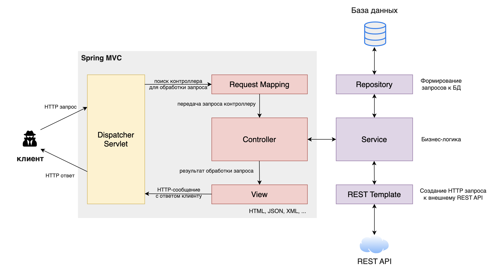

---

## Демо-проект: "Course API"

- Создание REST API для чтения/создания/изменения/удаления информации о курсах

  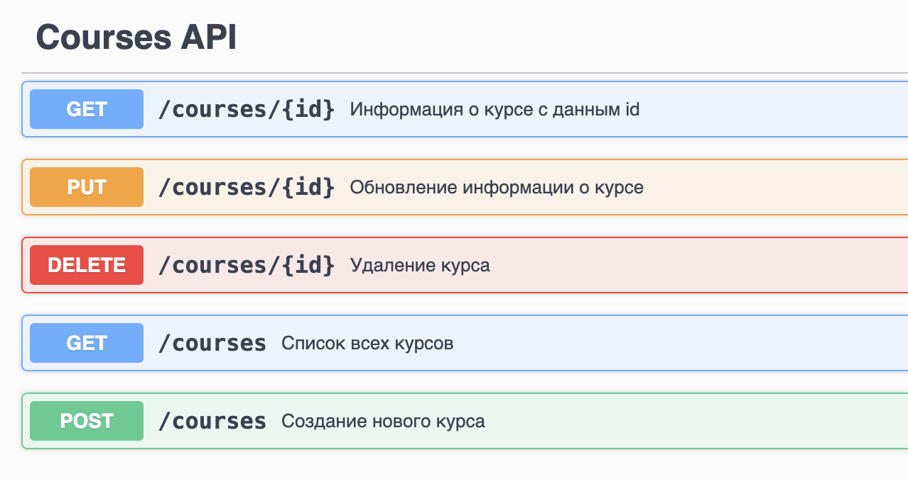

- Используемые технологии:
  - Spring MVC
  - Spring Data JPA
  - База данных H2

---

## Создание приложения

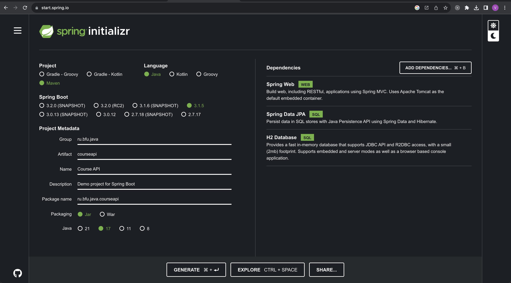

---

## Структура приложения

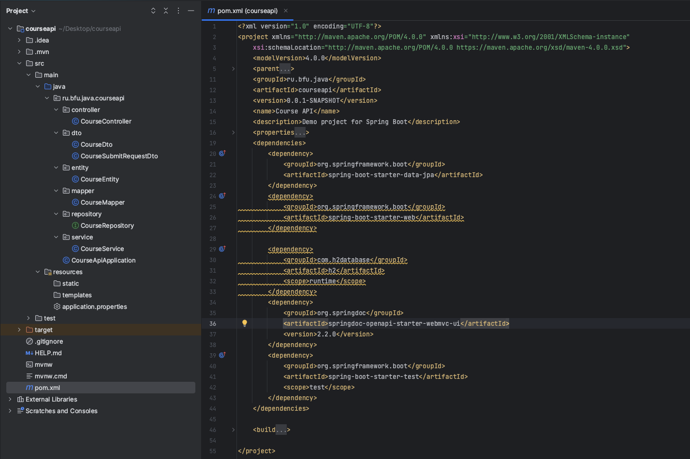

**Внимание**: дополнительная зависимость `springdoc-openapi-starter-webmvc-ui` для автоматического создания документации API.

---

## Архитектура приложения

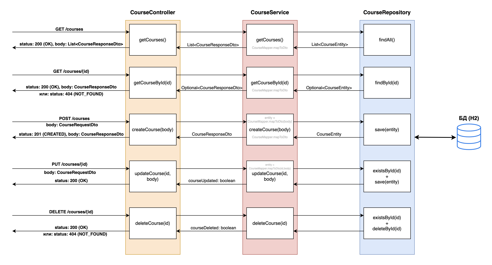

---

## `CourseController`

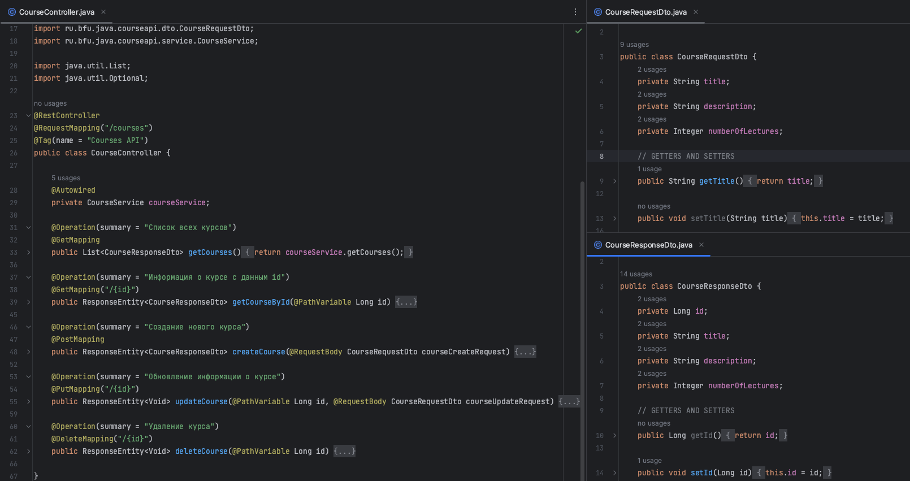

---

## `CourseEntity` - модель для таблицы БД

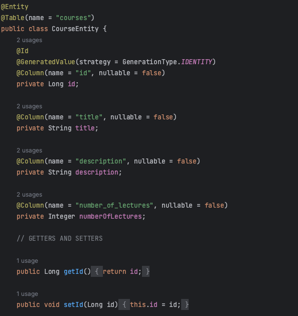

---

## `CourseRepository`

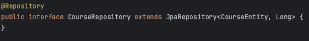

---

## `CourseService`

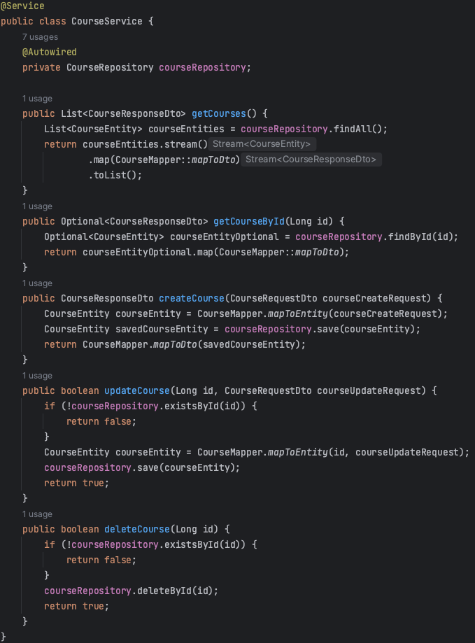

---

## `CourseMapper`

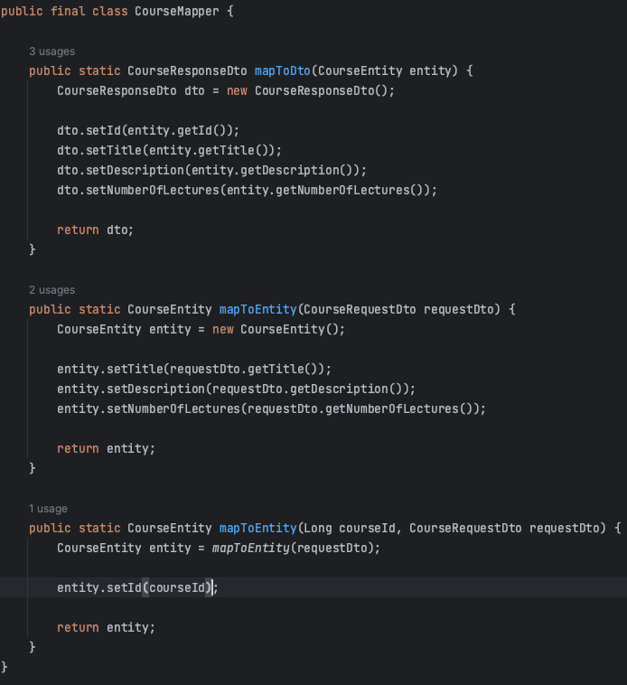

---

## Конфигурационные параметры

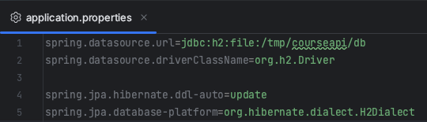

---

## SwaggerUI

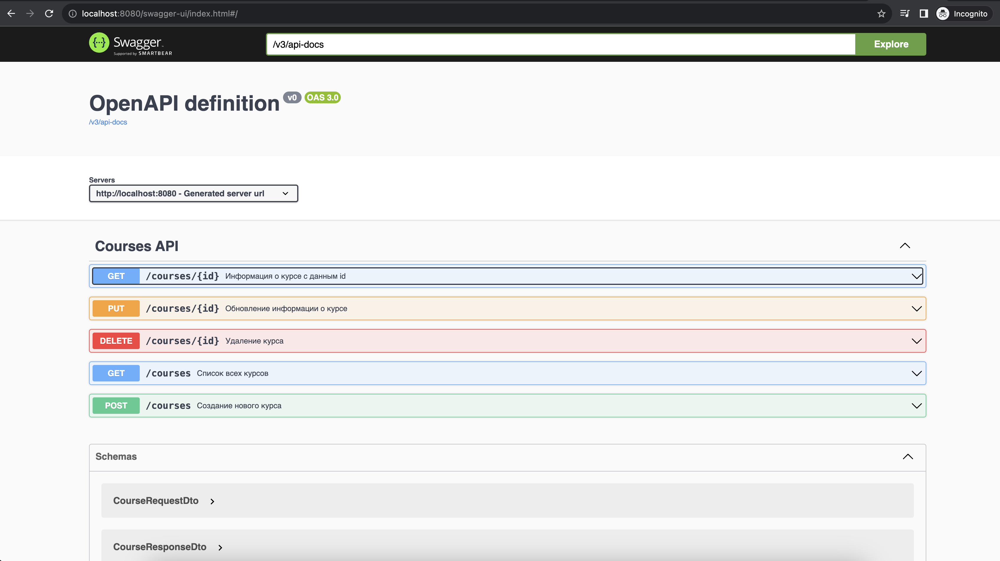

---

## Упражнение

1. Добавить API для управления студентами (чтение данных, добавление, изменение, удаление)
2. (**Более сложное задание**) Добавить API для регистрации студентов на курсы

Демо-проект с Course API доступен [здесь](https://github.com/perevos/java-master-23/tree/main/lectures/lecture7/code)
